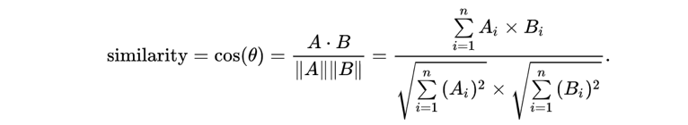

## 问题背景
智能营销技术近年来在互联网金融、在线广告等业务中广泛应用，不仅仅能很大程度提高营销的响应转化率，更能精准触达用户，在大量节省营销成本的同时，减少对用户的干扰。相似人群扩展是智能营销中广泛采用的一种技术，即基于少量的种子用户，通过一定的策略和算法，找到更多拥有潜在关联性的相似人群，从而在保证营销精准的同时，扩大营销的触达范围。比赛数据取材集团真实ID数据（已脱敏）。

## 问题抽象
假设营销业务方需要基于一定数量（1万）的种子用户，从58备选用户集（1000万）中，扩展出一定数量（10万）的最相似用户人群，进行营销触达，用户可用的特征为256维。这里假设余弦相似度越高，营销响应效果越好，最终筛选出来的目标用户为备选用户集合与种子用户计算相似度后，取去重后相似度最高的10万用户（求相似度，全排序，取Top10万）。

余弦相似度计算公式：


1. 程序输入
程序输入为种子用户ID数据集合，每一行包括用户ID和256维用户特征，用户特征数据类型为浮点型数据（存在部分数据用科学计数法表示的情况，比如1.4283673760891302E-4），所有数据分隔符为逗号，ID处于第1个位置，其它256维特征按照顺序处于2-257个位置。其中1-128维为连续性特征，数据都大于等于0小于等于1，余下129-256维为分类型特征经过one-hot处理过后的稀疏数据，数据都为0或者1。如下格式：
ID0001,0.1,0,0.56,…,0,1

2. 程序输出
程序输出为确定数量ID集合，每个ID占一行，代表扩展的最相似的用户人群（不需要考虑ID的次序），要求输出的ID满足评分标准才会被判为输出正确。


## 问题举例
问题举例： 有种子用户数据2条(4维度特征)，备选用户集10条(4维度特征)，通过相似度计算筛选最相似的用户5条。

种子用户集(A1-An为种子用户ID)：
```
A1,0.52,0.1,1,0
A2,0.51,0.33,1,1
```

备选用户集(B1-Bn为备选用户ID)：
```
B1,0.74,0.83,1,0
B2,0.8,0.29,0,0
B3,0.79,0.81,1,0
B4,0,0.8,0,0
B5,0.83,0.78,0,1
B6,0,0.83,0,1
B7,0.81,0,1,1
B8,0.77,0.81,1,1
B9,0.85,0.777,1,1
B10,0.8,0.74,1,1
```

相似度计算排序结果：
```
种子ID	备选用户ID	相似度
A2	B10	0.96514337
A2	B7	0.96199005
A2	B8	0.95879167
A2	B9	0.95825070
A1	B3	0.87307449
A1	B1	0.86738039
A1	B7	0.77065527
A1	B10	0.73753312
A1	B9	0.73639182
A1	B8	0.72631440
A2	B5	0.72044165
A2	B3	0.71862030
A2	B1	0.71739608
A2	B6	0.63687007
A1	B2	0.46215526
A2	B2	0.38458306
A1	B5	0.29713084
A1	B2	0.46215526
A2	B4	0.21440327
A1	B4	0.08837454
A1	B6	0.05644212
```

文件输出：
```
B10
B7
B8
B9
B3
```

## 评价标准
1. 比赛结果以营销触达准确率（P）和计算耗时（T）的综合结果，作为比赛的最终评判标准。
准确率定义：
采用用户程序的输出结果集和预先计算的标准结果集进行比较，如果全部比对准确则准确率为1。公式如下：


计算耗时定义：


最终评估标准（在保证准确率的基础上，耗时越少排名越靠前）
相似度结果四舍五入保留8位小数
准确率P超过一定阈值 ，这里设为98%（包含98%）
按照程序耗时T ( P≥98%)从小到大排序，耗时越少越好

2. 比赛会限制最大内存使用为4G，CPU为4核。共提供三组备选用户集和种子集文件，逐级增加数据量，分别为1万、10万和100万，比赛会依次将各备选用户数据集和种子集作为输入，运行参赛者提交的程序，并判断输出的ID是否正确。数据集大小如下表所示。
```
数据集	种子文件	备选集（万）	输出（万）
seed.txt	all.txt	result.txt
dataset1	100	1	0.1
dataset2	1000	10	1
dataset3	10000	100	10
```

3. 比赛会限制每一组数据集的最大执行时间，到达最大执行时间，系统会自动终止程序运行，本数据集成绩无效，具体限制如下：第一组30秒，第二组5分钟，第三组1小时；其中，第三组数据集最大执行时间会随着比赛进度的推进适当调整。
4. 比赛排名会综合考虑准确率和程序运行时间两个因素。
5. 排名优先计算运行正确的数据集数量（满足准确性要求即可），运行正确的数据集越多，排名越靠前。
6. 只有前一个数据集运行正确的前提下才会运行下一个，如果某个数据集运行错误，后续的数据集将不再输入。
7. 程序运行时间由process函数运行时长决定。程序运行时间由各语言的框架计算，参赛者不需要自己统计。


## 其他说明
1. 支持C++、Java、PHP、NodeJS和Python五种编程语言
2. 线上编译&运行环境: 线上编译&运行环境: C++(gcc 4.8.5)、Java(jdk1.8.0_144)、PHP(8.0.0)、NodeJS(v14.15.1)、Python（3.6）
3. 组委会提供了各个语言的程序框架，实现了读取输入文件、输出计算结果和统计运行时间等功能。每个语言的框架中都定义了一个名为Solution的类，参赛者需要实现其中的process函数。process为处理函数，框架会把输入文件直接传给process函数，process需要读取并处理文件，框架提供名为addSet的回调函数，依次将每个相似度人群集合写入addSet接口，作为结果输出。提交代码时，参赛者只需要提交定义了Solution类的文件（solution.cpp/Solution.java/Solution.php/Solution.js/solution.py）即可
4. 比赛代码中允许使用多进程、多线程，禁止使用网络。
5. 参赛者可以下载各个语言的框架进行本地调试，调试通过后再进行提交。在各个语言的框架里都包含一个示例性的输入文件（种子用户）、备选用户数据集合、输出结果集数量以及标准答案输出集，文件名分别为seed.txt、all.txt、count.txt以及result.txt，参赛者可以使用这组示例文件验证自己程序的正确性。本地运行程序需要提供四个参数，依次为：输入文件所在目录、输出文件完整路径（包含文件名），用时记录文件，临时目录。
6. 组委会将对所有最终获奖者进行代码review，利用题目、数据、网站漏洞取得排名的参赛者将取消成绩

